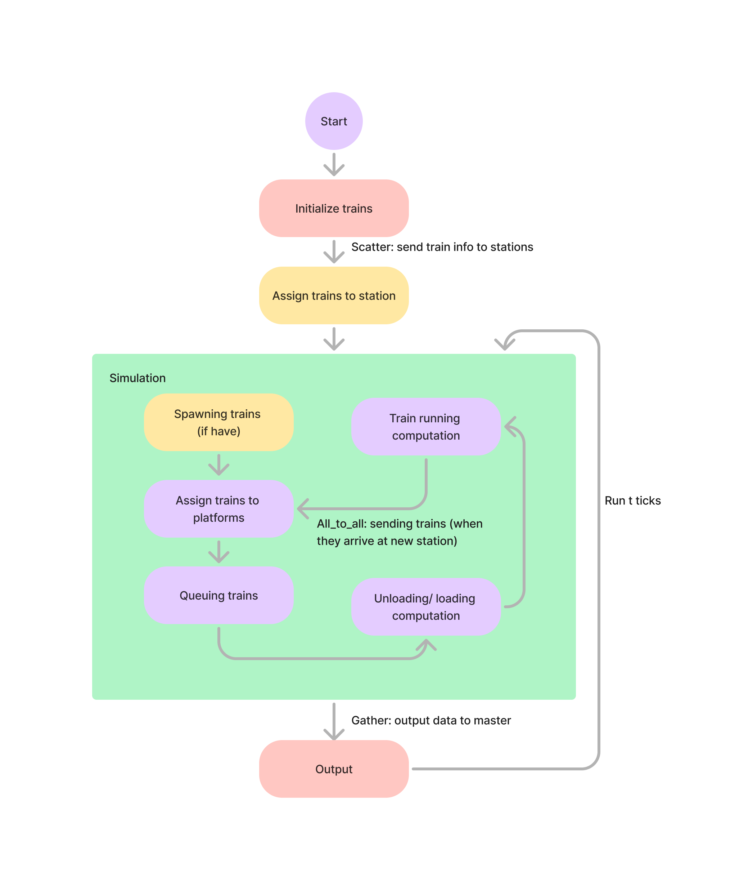

# Assigment 3: Simulation of MRT Network in MPI
 CS3210 2024/25 Semester1

The simulation implements a **parallel-by-station** approach, where each process is responsible for handling a designated group of stations. Within each station, platforms serve as focal points for train-related computations.

For each platform within a station, the following tasks are performed:
- Updating unloading/loading wait times and train status
- Assigning incoming trains to the queue based on their arrival time and id.
- Controlling the status of the connected line: i.e. a platform at clementi station, leading to harbourfront, manages the line directly connecting the two stations. Additionally, the platform updates train information, facilitating efficient routing and decision-making.

At the station level, tasks include:
- Managing inter-station train transfers: get train information from other stations to assign trains to the appropriate platform.
- Spawning new trains each tick based on predefined requirements.

To ensure policy compliance and synchronization, the master process (process rank 0) pre-assigns all train details, including their unique identifiers and respective lines. These details are then scattered to the respective processes before the simulation begins, ensuring consistency across all operations.

## A picture worth a thousand words

## MPI Functions
Functions: `MPI_Scatterv`, `MPI_Gatherv`, `MPI_Alltoallv`

Full report: [here](https://github.com/nus-cs3210/cs3210-assignment3-a3-e1345627/blob/main/Assignment%203_report.pdf)
